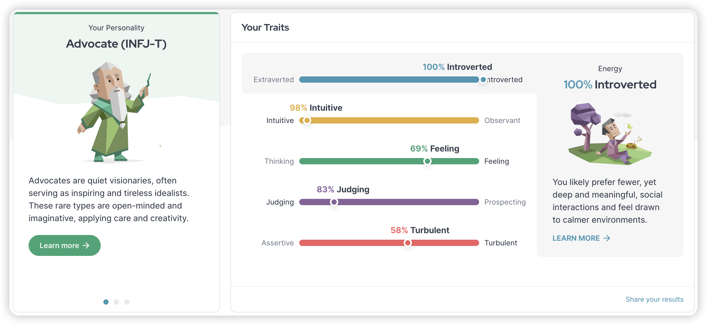

<p align="left"><strong><samp>「</samp></strong></p>
  <p align="center">
    <samp>
      <b>
        Hello There
      <br>
        I'm Aaron, INFJ-T, I use linux and macOS.
      </b>
      <br>
        <image src="https://readme-typing-svg.herokuapp.com?font=Signika+Negative&size=16&pause=1000&color=81A1C1&random=false&width=435&lines=The+world+is+full+of+lonely+people+afraid+to+make+the+first+move.">
      <br>
      <b>
         ~ Green Book ~
      </b>    </samp>
  </p>
<p align="right"><strong><samp>」</samp></strong></p>
<br>

#### Skills & Tools

<!-- Badges List: https://github.com/alexandresanlim/Badges4-README.md-Profile -->
<!-- Badges Search: https://github.com/Aveek-Saha/GitHub-Profile-Badges -->

[](https://github.com/torvalds/linux)
[](https://github.com/NixOS)
[](https://github.com/gentoo)
[](https://github.com/archlinux)
[](https://github.com/AsahiLinux)
[](https://github.com/Debian)
[](https://github.com/RedHatOfficial)
[](https://github.com/alpinelinux)
[](https://github.com/CentOS)
[](https://github.com/ubuntu)

[](https://github.com/neovim)
[](https://www.vim.org/)
[](https://developer.apple.com/xcode/)
[](https://www.jetbrains.com)
[](https://www.jetbrains.com/)
[](https://www.jetbrains.com/)
[](https://www.sublimetext.com/)
[](https://code.visualstudio.com/)

[]()
[](https://go.dev/)
[](https://www.java.com/)
[](https://nixos.org/)
[](https://www.lua.org/)
[](https://www.rust-lang.org/)
[](https://en.wikipedia.org/wiki/Shell_script)
[](https://www.w3schools.com/html/)
[](https://www.w3schools.com/css/)
[](https://www.w3schools.com/js/)

<details>
<summary><samp><b>&#9776; Myers–Briggs Type Indicator</b></samp></summary>
  </summary>
  <div align="center">
  <table>
  <tr>
  <td><a href="https://www.16personalities.com/"></a></td>
  </tr>
  </table>
  </div>
</details>
</br>

<details>
<summary><samp><b>&#9776; See more details</b></samp></summary>
  </summary>

  <!-- Github Trophy -->
  <div align="center">
  <table>
  <tr>
    
  <td><a href="#--------"></a></td>
  </tr>
  </table>
  </div>

  <!-- Github Stats -->
  <div align="center">
  <table>
  <tr>
  <td><a href="#--------"></a></td>
  <td><a href="#--------"></a></td>
  </tr>
  </table>
  </div>

  <!-- Contribution Snake -->
  <div align="center">
  <table>
  <tr>
  <td><a href="#--------"></a></td>
  </tr>
  </table>
  </div>

## Weekly Activity Summary
<!--START_SECTION:waka-->
**🐱 My GitHub Data** 

> 📦 11.2 kB Used in GitHub's Storage 
 > 
> 🏆 717 Contributions in the Year 2024
 > 
> 🚫 Not Opted to Hire
 > 
> 📜 14 Public Repositories 
 > 
> 🔑 2 Private Repositories 
 > 
**I'm an Early 🐤** 

```text
🌞 Morning                88 commits          ████░░░░░░░░░░░░░░░░░░░░░   16.09 % 
🌆 Daytime                346 commits         ████████████████░░░░░░░░░   63.25 % 
🌃 Evening                100 commits         █████░░░░░░░░░░░░░░░░░░░░   18.28 % 
🌙 Night                  13 commits          █░░░░░░░░░░░░░░░░░░░░░░░░   02.38 % 
```
📅 **I'm Most Productive on Thursday** 

```text
Monday                   93 commits          ████░░░░░░░░░░░░░░░░░░░░░   17.00 % 
Tuesday                  65 commits          ███░░░░░░░░░░░░░░░░░░░░░░   11.88 % 
Wednesday                87 commits          ████░░░░░░░░░░░░░░░░░░░░░   15.90 % 
Thursday                 111 commits         █████░░░░░░░░░░░░░░░░░░░░   20.29 % 
Friday                   72 commits          ███░░░░░░░░░░░░░░░░░░░░░░   13.16 % 
Saturday                 54 commits          ██░░░░░░░░░░░░░░░░░░░░░░░   09.87 % 
Sunday                   65 commits          ███░░░░░░░░░░░░░░░░░░░░░░   11.88 % 
```


📊 **This Week I Spent My Time On** 

```text
💬 Programming Languages: 
Other                    19 hrs 51 mins      ████████████░░░░░░░░░░░░░   47.78 % 
Nix                      6 hrs 58 mins       ████░░░░░░░░░░░░░░░░░░░░░   16.77 % 
Markdown                 6 hrs 44 mins       ████░░░░░░░░░░░░░░░░░░░░░   16.21 % 
Lua                      5 hrs 22 mins       ███░░░░░░░░░░░░░░░░░░░░░░   12.93 % 
Python                   21 mins             ░░░░░░░░░░░░░░░░░░░░░░░░░   00.86 % 

🔥 Editors: 
Chrome                   19 hrs 36 mins      ████████████░░░░░░░░░░░░░   47.17 % 
VS Code                  17 hrs 26 mins      ██████████░░░░░░░░░░░░░░░   41.97 % 
Neovim                   3 hrs 35 mins       ██░░░░░░░░░░░░░░░░░░░░░░░   08.65 % 
Intellijidea             53 mins             █░░░░░░░░░░░░░░░░░░░░░░░░   02.16 % 
Unknown Editor           1 min               ░░░░░░░░░░░░░░░░░░░░░░░░░   00.06 % 

💻 Operating System: 
Mac                      40 hrs 31 mins      ████████████████████████░   97.48 % 
Linux                    1 hr 2 mins         █░░░░░░░░░░░░░░░░░░░░░░░░   02.52 % 
```

**I Mostly Code in Nix** 

```text
Nix                      2 repos             ████████░░░░░░░░░░░░░░░░░   33.33 % 
Lua                      1 repo              ████░░░░░░░░░░░░░░░░░░░░░   16.67 % 
CSS                      1 repo              ████░░░░░░░░░░░░░░░░░░░░░   16.67 % 
JavaScript               1 repo              ████░░░░░░░░░░░░░░░░░░░░░   16.67 % 
HCL                      1 repo              ████░░░░░░░░░░░░░░░░░░░░░   16.67 % 
```


**Timeline**


<!--END_SECTION:waka-->

  </details>
  </div>
  
</details>